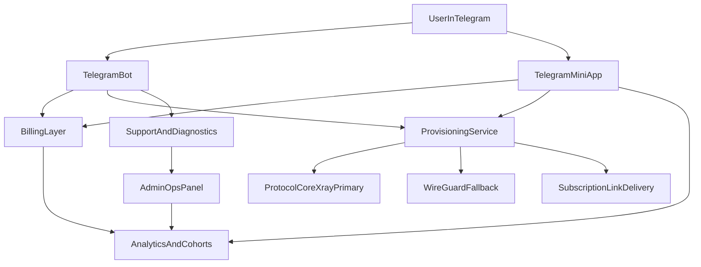

# PRD MamaVPN

## Статус документа

- Версия: 1.0
- Рынок: RU/CIS
- Объем продукта: флагманский Telegram-first VPN сервис
- Основной язык: русский
- Поверхности продукта: Telegram-бот, Telegram Mini App, backend control plane, billing, support, admin tools

## 1. Видение продукта

MamaVPN это Telegram-native anti-censorship VPN сервис для RU/CIS пользователей, которым нужен рабочий интернет с минимальной настройкой, быстрой поддержкой и надежным восстановлением после новых блокировок.

Продукт должен ощущаться так:

- открыл Telegram
- нажал несколько кнопок
- получил рабочее подключение меньше чем за минуту
- управляешь подпиской, устройствами, продлением и поддержкой, не выходя из Telegram

Это не «просто VPN-бот». Это подписочный сервис, у которого основная операционная поверхность находится в Telegram.

## 2. Проблема

Пользователи RU/CIS сталкиваются с набором проблем, которые generic VPN-продукты решают плохо:

- классические VPN-протоколы деградируют или блокируются
- онбординг через сайт, приложение и платежную форму слишком медленный
- многие пользователи не хотят сразу брать длинную подписку без теста
- когда появляются новые блокировки, люди не понимают, что делать дальше
- поддержка часто живет отдельно от канала, через который пользователь получил доступ

Рынок выигрывают те, кто снимает трение и быстро реагирует на новые ограничения. MamaVPN должен проектироваться именно под эту реальность.

## 3. Позиционирование продукта

### Базовое позиционирование

Telegram-first VPN, который быстро подключается, переживает новые блокировки и управляется из одного места.

### Формулировка позиционирования

Для RU/CIS пользователей, которым нужен стабильный доступ к заблокированным или нестабильно работающим интернет-сервисам, MamaVPN это Telegram-native anti-censorship VPN, который дает setup, billing, renewals, support и recovery внутри Telegram, в отличие от обычных VPN-приложений, которые добавляют трение и медленно реагируют на новые ограничения.

### Стратегические отличия

- Telegram-native onboarding и support
- anti-block стек, спроектированный под RU/CIS-реалии
- доставка конфигов через subscription links с быстрыми обновлениями
- low-friction входная цена
- сильные retention-механики: reminder-ы, fallback-флоу, proactive updates
- growth-движок, встроенный в продукт: referral, promo, rewards, premium-tiers

## 4. Целевые пользователи

### Сегмент A: массовый Telegram-пользователь

Потребности:

- быстрый setup
- низкая цена для первой пробы
- простой язык
- стабильный доступ к Telegram, медиа, AI-сервисам и заблокированным сайтам

### Сегмент B: активный интернет-пользователь

Потребности:

- более высокая стабильность
- больше локаций
- несколько устройств
- меньше сбоев при новых волнах блокировок

### Сегмент C: пара / семья / домашний сценарий

Потребности:

- использование на нескольких устройствах
- простое продление
- платит один человек, подключаются несколько

### Сегмент D: power user

Потребности:

- fallback-опции
- приватные или более изолированные ресурсы
- поддержка роутера / ТВ
- больше прозрачности и контроля

## 5. Jobs To Be Done

### Функциональные задачи

- «Я хочу получить рабочий VPN в Telegram без сложного сайта».
- «Я хочу протестировать сервис перед нормальной оплатой».
- «Я хочу, чтобы подключение продолжало работать даже после новых блокировок».
- «Я хочу продлевать или менять план за секунды».
- «Если что-то ломается, я хочу получить ответ и путь решения внутри Telegram».

### Эмоциональные задачи

- чувствовать, что сервис живой и поддерживается
- чувствовать, что команда контролирует ситуацию с блокировками
- чувствовать, что оплата и продление простые и не рискованные

## 6. Цели и не-цели

### Цели

- доводить пользователя от `/start` до первого успешного подключения меньше чем за 60 секунд
- максимизировать конверсию из trial в оплату
- построить сильные renewal и retention loops
- снижать нагрузку на поддержку через self-service
- поддерживать высокий unblock success rate при меняющихся ограничениях

### Не-цели

- строить generic website-first VPN бренд
- полагаться вечно только на один статичный протокол
- побеждать только самой низкой ценой
- обещать недоказуемые security или infrastructure claims

## 7. Продуктовые принципы

- friction важнее feature-count на ранней конверсии
- обновления и восстановление так же важны, как первичный onboarding
- каждое важное действие должно быть доступно из Telegram
- claim-ы должны быть правдоподобными и операционно поддерживаемыми
- fallback path это first-class feature, а не скрытый ops-хак

## 8. Основные поверхности продукта

### 8.1 Telegram-бот

Основные функции:

- onboarding
- выбор плана
- активация trial
- выбор устройства
- выдача конфига / ключа
- продления
- вход в поддержку
- reminder-ы и broadcast-ы
- referral и promo-механики

### 8.2 Telegram Mini App

Основные функции:

- более чистый UX для тарифов и checkout
- сравнение планов
- обзор активной подписки
- управление сервером / локацией
- показ статуса и использования
- кабинет аккаунта и рефералки
- premium upsell-поверхности

### 8.3 Backend control plane

Основные функции:

- provisioning пользователей, ключей и subscription links
- billing state и entitlement management
- назначение протокола и route
- управление anti-block rollout-ами
- автоматизация инцидентов и статусов
- аналитика и cohort tracking

### 8.4 Admin и ops-слой

Основные функции:

- здоровье серверов и нод
- cohort performance
- support tooling
- управление promo-механиками
- referral payouts / balances
- инструменты миграции конфигов

## 9. Архитектура решения

## 10. Техническое направление

### Основное протокольное направление

Базовый стек:

- Xray/VLESS/Reality/obfuscation-first

Почему:

- это лучше подходит для high-block среды, чем чистая WireGuard-first стратегия
- такой стек легче адаптировать, когда начинают таргетировать трафик

### Вторичное / fallback направление

- WireGuard как fallback для пользователей или сценариев, где он показывает себя лучше
- возможен отдельный premium или power-user tier в зависимости от ops-cost

### Модель доставки

- subscription links и автообновляемые конфиги по умолчанию
- минимизация ручной перенастройки после смены протокола, хоста или маршрута

### Паттерн control plane

- provisioning и management модель в стиле Marzban или совместимая абстракция
- возможность ротировать маршруты, хосты и delivery details без полного повторного онбординга пользователя

## 11. Требования к фичам

### 11.1 Onboarding

Обязательно:

- входной flow через `/start`
- короткое и ясное value proposition
- one-tap путь в trial или покупку
- выбор устройства
- auto-selection протокола / route по умолчанию
- понятные инструкции для первого подключения

Критерий успеха:

- время до первого подключения меньше 60 секунд для массового сценария

### 11.2 Trial

Обязательно:

- бесплатный или символически платный trial
- понятные лимиты trial: время, трафик или устройства
- никакой неясности, когда trial заканчивается и что будет дальше

Важное правило:

- никакой противоречивой информации о trial между ботом, Mini App, лендингом и сообщениями поддержки

### 11.3 Планы и ценообразование

Обязательно:

- daily entry plan
- monthly standard plan
- yearly value plan
- multi-device опция
- premium/private tier

Рекомендуемый пример структуры:

- Trial: ограниченный трафик, 1 устройство
- Daily Starter: максимально низкий вход
- Monthly Core: основной конвертирующий план
- Yearly Best Value: сильная экономия
- Private / Personal Server: premium ARPU expansion

### 11.4 Billing

Обязательно:

- локально удобные платежные способы
- криптооплата
- опциональная поддержка Telegram Stars для импульсных или микроплатежей
- ручное продление и/или автоrenew в зависимости от платежного рельса
- grace period после истечения подписки, где это возможно

Важное замечание:

- Telegram Stars должны быть дополнительным каналом, а не единственным core-rail, из-за давления на маржу

### 11.5 Поддержка устройств и платформ

Обязательно:

- iPhone
- Android
- macOS
- Windows
- Linux
- Android TV / Smart TV там, где поддержка реалистична

Желательно:

- инструкции для роутеров под advanced users

### 11.6 Доставка конфигов и ключей

Обязательно:

- one-tap выдача конфигов
- subscription links
- запасные ключи
- refresh / reissue path
- явный CTA «обновите подписку» после новых блокировок

### 11.7 Anti-block operations

Обязательно:

- несколько delivery path / route
- fallback-опции под конкретного оператора или сценарий, если это нужно
- status broadcast-ы при крупных событиях блокировок
- быстрая миграция конфигов
- backup transport / backup key concepts

Это core product area, а не скрытая операционная деталь.

### 11.8 Support и диагностика

Обязательно:

- support bot или support entry point внутри Telegram
- типовые диагностические сценарии:
  - не подключается
  - подключается, но сайты не открываются
  - подписка истекла
  - конфиг устарел
  - платеж не отразился
- escalation path до человека

### 11.9 Lifecycle и retention

Обязательно:

- reminder-ы о завершении подписки минимум за 48 и 24 часа
- renewal CTA внутри reminder-ов
- инструменты компенсации после инцидентов
- reactivation-кампании после churn
- promo engine с ограниченными по времени офферами

### 11.10 Referral и growth

Обязательно:

- персональная referral link для пользователя
- видимая логика награды
- трекинг бонусного баланса или бонусных дней
- invite-to-bonus flow, который легко понять

Рекомендуется:

- агрессивная, но экономически устойчивая referral economics
- награда в виде баланса, бонусных дней или service credit

### 11.11 Premium / Private upsell

Обязательно:

- premium-оффер должен отличаться не только длительностью
- примеры:
  - private или personal server
  - усиленный routing profile
  - больше устройств
  - приоритетная поддержка

### 11.12 Broadcast и community layer

Обязательно:

- официальный канал обновлений
- support contact
- incident и anti-block updates

Рекомендуется:

- community chat
- contest или promo-механики
- creator и affiliate growth loops

## 12. Пользовательские флоу

### Flow A: первый запуск -> trial

1. Пользователь открывает бота и нажимает `Start`
2. Бот коротко объясняет core value
3. Пользователь выбирает `Попробовать бесплатно`
4. Бот просит выбрать устройство
5. Система выдает trial access
6. Пользователь получает конфиг / subscription link и инструкции
7. Бот спрашивает, получилось ли подключиться
8. Если да, пользователь переходит в lifecycle flow
9. Если нет, запускается diagnostics flow

### Flow B: trial -> paid

1. Trial подходит к концу или упирается в лимит
2. Бот отправляет reminder с value-based upsell
3. Пользователь открывает выбор плана
4. Пользователь выбирает план
5. Оплата проходит в Telegram-friendly flow
6. Entitlements обновляются сразу
7. Конфиг продолжает работать или обновляется автоматически

### Flow C: продление активного пользователя

1. Пользователь получает reminder-ы за 48 и 24 часа
2. Нажимает продлить
3. Бот или Mini App открывает текущий план и альтернативы
4. Пользователь оплачивает
5. Подписка продлевается без принудительной повторной настройки

### Flow D: восстановление после блокировок

1. Система или support фиксируют рост ошибок
2. Broadcast уведомляет затронутых пользователей
3. Бот подсвечивает action на обновление
4. Пользователь обновляет подписку или переключает route
5. Если нужно, бот выдает fallback key
6. Система измеряет recovery success

### Flow E: поддержка

1. Пользователь нажимает `Помощь`
2. Бот предлагает структурированные варианты проблемы
3. Пользователь получает guided steps
4. Если не помогло, открывается escalation в поддержку
5. История обращения и тип проблемы видны оператору

## 13. Монетизация

### Основная выручка

- платные подписки
- апгрейды из trial
- годовые планы
- multi-device планы
- premium/private tiers

### Вторичная выручка и growth

- рефералка
- creator-кампании
- промо-акции
- расширение в family-сценарии

### Принципы ценообразования

- low-friction первая покупка
- ясный upgrade path
- premium-tier должен давать ощутимую дополнительную ценность
- никаких запутанных скрытых ограничений

## 14. Аналитика и метрики

### Acquisition metrics

- объем запусков бота
- конверсия из канала в бота
- объем стартов по referral
- доля разных paid acquisition source

### Activation metrics

- конверсия start -> trial
- конверсия start -> paid
- время до первого подключения
- success rate первой настройки

### Monetization metrics

- конверсия trial -> paid
- средняя выручка на пользователя
- доля годовых планов
- доля premium/private tiers
- success rate платежей

### Retention metrics

- retention day 7
- retention day 30
- renewal rate
- churn после первого платежного цикла
- reactivation rate

### Support и reliability metrics

- число обращений в поддержку на 100 платящих пользователей
- median first-response time
- median resolution time
- incident recovery time
- unblock success rate по route / protocol / operator

## 15. Требования к надежности и доверию

Сервис не должен повторять trust-провалы слабых конкурентов.

Требования:

- условия trial должны быть одинаковыми на всех поверхностях
- цены и лимиты должны быть явно прописаны
- коммуникация об outage должна быть быстрой и честной
- compensation policy должна быть последовательной
- security и infrastructure claims должны оставаться доказуемыми

## 16. Риски

### Рыночные риски

- быстрые изменения в блокировках
- нестабильность платежных рельс
- ценовая конкуренция со стороны low-trust сервисов

### Продуктовые риски

- перегрузка поддержки, если setup UX будет слабым
- churn, если update/migration flow будет неудобным
- потеря доверия из-за несогласованного месседжинга

### Технические риски

- избыточная зависимость от одного протокола или route pattern
- хрупкая доставка конфигов
- слабая наблюдаемость во время инцидентов

## 17. MVP-объем

MVP должен доказать, что Telegram-first delivery умеет конвертировать и удерживать пользователей.

Включено в MVP:

- bot onboarding
- trial
- daily / monthly / yearly планы
- 1 устройство + multi-device упаковка
- базовые платежные рельсы
- доставка конфигов / subscription
- support flow
- reminder-ы
- простая referral system
- статусный канал обновлений
- базовые admin-инструменты для provisioning и support

Не требуется в MVP:

- сложные family features
- обширные contest-механики
- полноценный affiliate back office
- глубокая персонализация

## 18. Объем V1

V1 должен усилить retention и anti-block устойчивость.

Включено в V1:

- Mini App dashboard
- premium/private tier
- fallback key flows
- расширенная диагностика
- более богатая аналитика
- автоматизация компенсаций
- operator-specific или scenario-specific routing playbooks

## 19. Фаза роста

Growth features:

- creator-кампании
- contest engine
- более глубокая referral economics
- team/family планы
- более умная сегментация upsell

## 20. Чеклист запуска

- финализирован onboarding copy
- правила trial одинаковы везде
- протестированы платежные флоу
- протестирована доставка конфигов на всех основных устройствах
- работают reminder-ы на продление
- готовы support macros и diagnostics
- готов status channel
- задокументирован incident fallback playbook
- готов dashboard метрик

## 21. Финальный продуктовый тезис

MamaVPN должен выигрывать за счет сочетания:

- качества онбординга лучших Telegram VPN сервисов
- low-friction монетизации продуктов с daily-планами
- referral и private-tier мышления более продвинутых ботов
- дисциплины поддержки и компенсаций сильных операторов
- anti-block коммуникации и recovery cadence самых зрелых игроков рынка

Если это реализовать правильно, результат не будет ощущаться как еще один VPN subscription bot. Это будет ощущаться как живой anti-censorship сервис, который полностью управляется через Telegram.
